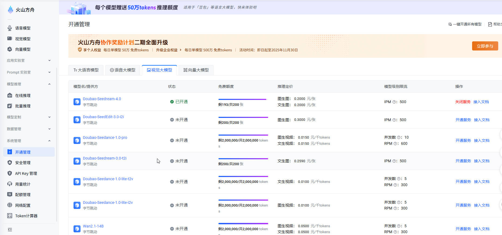
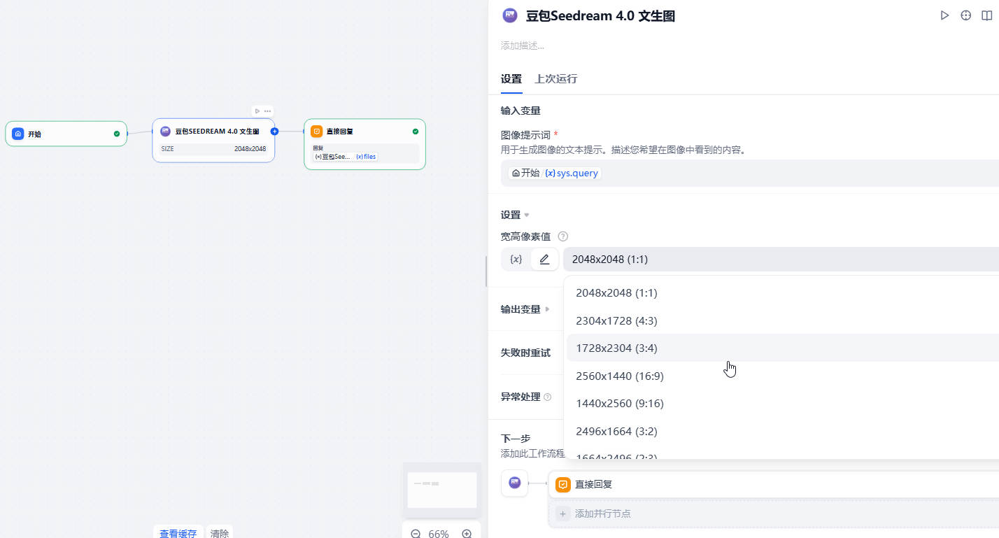

# 豆包 Seedream 4.0文生图

基于火山引擎方舟 Doubao Seedream 4.0 的 AI 文生图插件，支持单图、多图的生成及下载。
> 免责声明：该插件由dify爱好者所创建，并非由字节跳动官方维护。
## 功能特性

- 使用 Doubao Seedream 4.0（`doubao-seedream-4-0-250828`）进行文生图
- 可配置输出尺寸（如 `2048x2048`、`2560x1440`）

### 1.文本生成图像（文生图）

- **高质量图像生成**：根据文本描述生成精美图片
- **多种尺寸选择**：正方形（1024×1024）、纵向（1024×1792）、横向（1792×1024）
- **多图生成**：支持一次生成多张图片
- **图片下载**：支持直接下载生成的图片

## 快速开始

### 前置要求
- Dify 平台访问权限
- 火山引擎账户并开通Seedream 4.0服务

### 步骤 1：获取 API 密钥
1. 访问 [获取火山引擎控制台api-key](https://console.volcengine.com/ark/region:ark+cn-beijing/apiKey)
2. 创建账户或登录现有账户
3. 导航至`开通管理 > 视觉大模型`，开通 Seedream 4.0 服务，免费送200次生图。
4. 在控制台生成您的 API 密钥

### 步骤 2：安装插件
1. 打开 Dify 插件市场
2. 搜索 "豆包Seedream 4.0"
3. 点击 "安装" 并等待安装完成

### 步骤 3：配置授权
1. 在 Dify 中，导航至 `插件 > 豆包Seedream 4.0 > API Key授权配置`
2. 输入您的火山引擎 API 密钥
3. 保存配置


### 4.开始使用
完成api-key配置后即可使用插件


### 5.提示词示例
```
生成单图：“一个女孩，金色的长发，金色的眼睛，金色的裙子”  
生成多图：“我需要4张故事连环画，讲述冒险家在森林中探险的故事”  
```
### 优化建议
- **选择合适的宽高比**：根据用途选择最佳比例

### 常见问题
- **API 密钥无效**：请验证火山引擎 API 密钥和服务权限
- **生成失败**：检查提示词是否符合内容政策
- **响应缓慢**：高峰期可能出现延迟，请稍后重试
## 🤝 参与贡献

欢迎您提出宝贵意见或贡献代码！您可以：
- 报告错误和问题
- 建议新功能
- 提交拉取请求
- 改进文档

## 📄 许可证

本项目遵循 LICENSE 文件中指定的许可条款。

---

* 由 Skylineneon 创建 